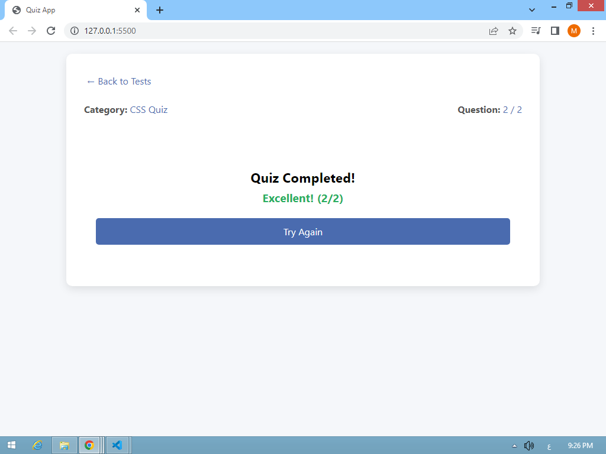
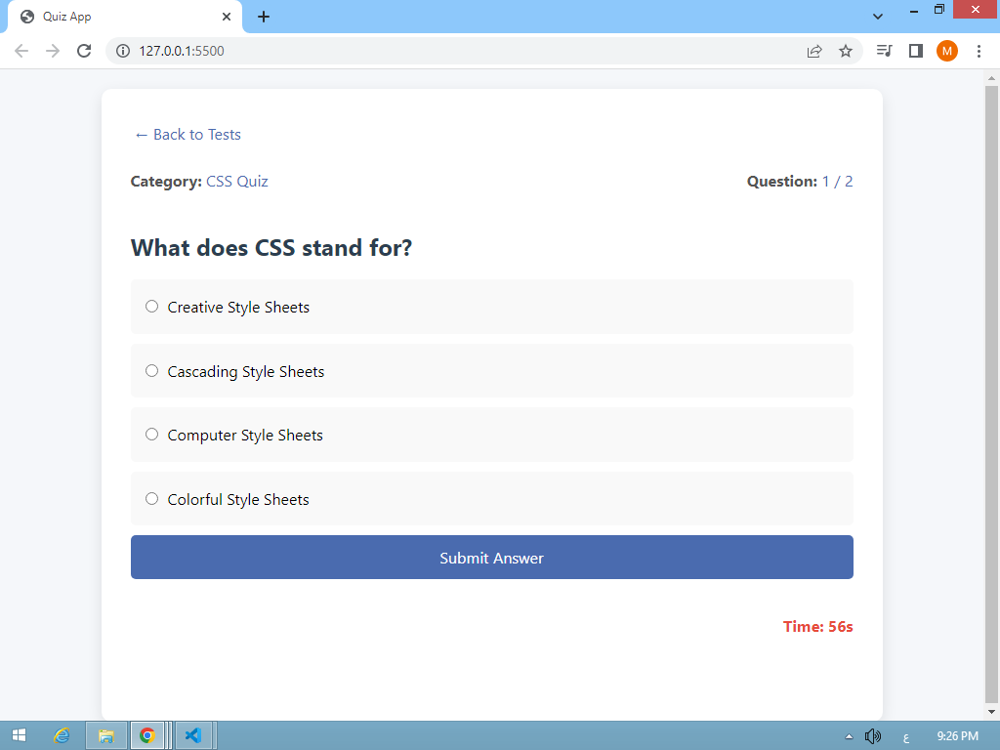
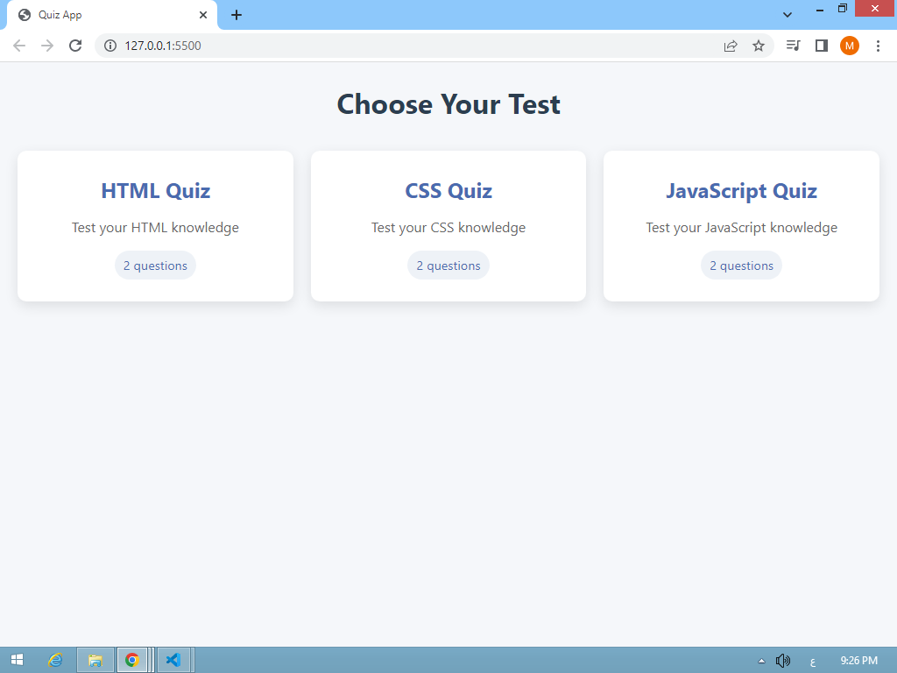

# 🧠 Quiz Web App

A dynamic and interactive quiz application built with HTML, CSS, and JavaScript. Users can select from various quiz categories, answer questions within a time limit, and view their final score and performance.

https://mohamed-gaber53.github.io/Quiz-App/

## 📸 Preview

## 🚀 Features

- 🔘 Select from multiple quiz categories (HTML, CSS, JavaScript)
- 🕓 Countdown timer for each question (default: 60 seconds)
- ✅ Multiple-choice questions with radio buttons
- 💡 Score evaluation with feedback (bad, good, perfect)
- ↩️ Try Again and Back functionality
- 📱 Fully interactive interface

## 🛠️ Technologies Used

- HTML5
- CSS3
- Vanilla JavaScript (ES6)

## 🔧 How to Use

1. Clone or download the repository.
2. Place your quiz JSON files inside the `/quizzes` folder.
3. Open `index.html` in a web browser.
4. Select a quiz category and begin answering questions.
5. Your score and performance will be shown after finishing the quiz or when time
